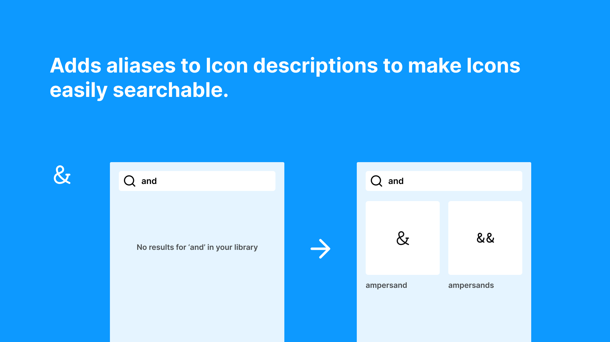

# Icon Aliases

Ever got frustrated while searching for a icon with a weird name? Icons can have very specific names, which makes them clear for development, but not so much for designers looking for it.

This plugin automatically adds aliases to Icon descriptions to make Icons easily searchable.

